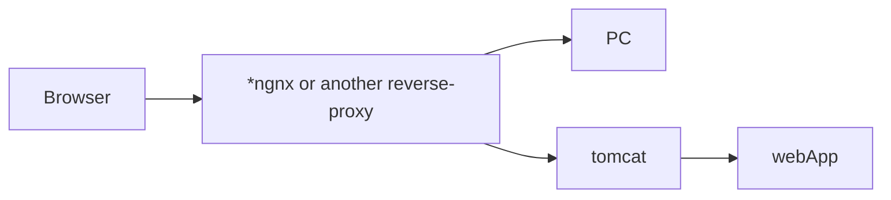
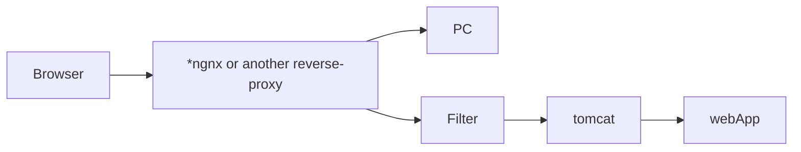

# Web (3-rd lecture) / Servlet

## Servlet api
- The standard of server frameworks.
- Most of java frameworks were based on this standard
- However, Servlet does not knows various modern features and many web applications are based on their own tools
- Servlet is a good way of working with server protocols, despite it's problems.

In fact, all the code is based on working with **request** and **response**
If web-app is written based on Servlet, it can be used on any server that support Servlet API.(**Servlet containers**)

## Tomcat

- Simple servlet container
-  After changes the compilation process may be reasonably slow (In fact java, will try to optimize process, but no guarantees are provided)
- Java creates reverse-proxy for many implementations

After the implementation we get **war-file** with compiled classes.

## Installations
1) Tomcat-9
2) Maven-3

## Links
1)MVN repository

## Maven/.xml/Idea
Creating maven project:
>maven-archetype:generate 

.xml - project descriptor

Project type:
>packaging>war<packaging

libraries:
>dependencies> ... <dependencies

Packaging project
>mvn package

.jsp files are useless template tool of very old times

## Filter

Filter distributes work and checks various keys. The user must name the key in order to continue session. With filters it is possible to require various keys to be mentioned in requests. It also possible to make redirect in various cases. If everything is OK we just skip the request through.
<!--stackedit_data:
eyJoaXN0b3J5IjpbLTU1Nzk3MTIyNV19
-->